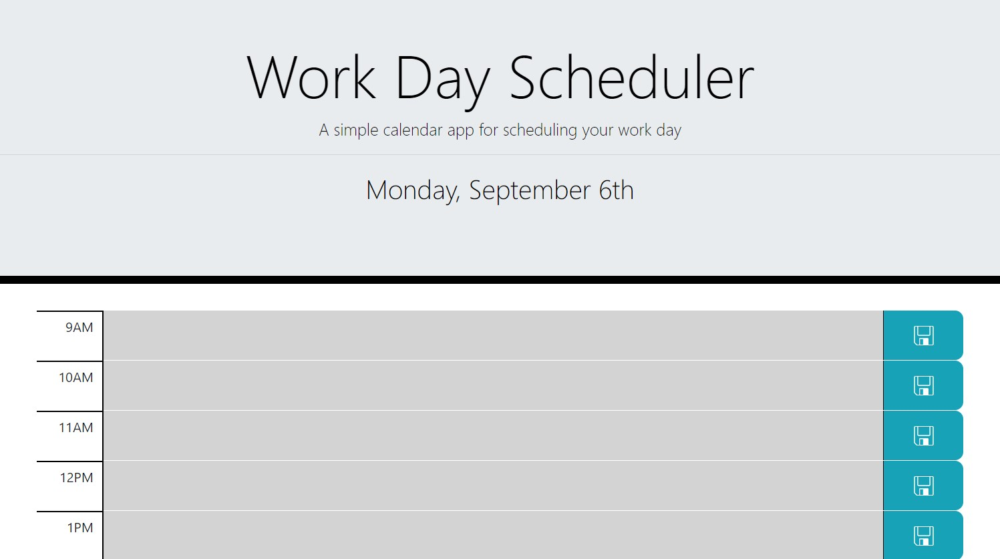

# Work-Day Scheduler
A web application for planning out your 9-to-5 workday.

## Usage
The website is hosted [here](https://jkohrt7.github.io/Work-Day_Scheduler/).

For each hour, there is a text area where events, 
reminders, and other notes can be typed. If this area
is grey, the hour has passed; if it is red, it is the 
current hour; and if it green, the hour is in the future.

The notes written in these areas can be saved locally by clicking
the blue floppy disk buttons to the right of each text event. If this button
is not pressed, any typed text will be lost when the page is reloaded.

## Credits

- [Jared Kohrt](https://www.github.com/jkohrt7)
- [Alper Gokcehan](https://www.github.com/alperg)

## License
[MIT License](LICENSE)